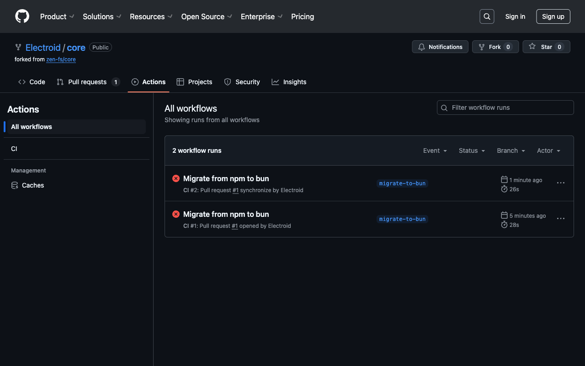

# npm vs bun Performance Comparison

This report summarizes the performance improvements gained by migrating from npm to bun.

## Benchmark Results

| Operation                | npm          | bun           | Speedup       |
| ------------------------ | ------------ | ------------- | ------------- |
| Installation (`install`) | 1.88 seconds | 0.062 seconds | ~30x faster   |
| Build (`run build`)      | 1.65 seconds | 1.30 seconds  | ~1.27x faster |

## CI Performance

GitHub Actions workflows have been updated to use bun instead of npm. The screenshot below shows the CI runs:

## Notable Improvements

1. **Package Management:**

    - Significantly faster dependency installation
    - Smaller lockfile (bun.lock is much smaller than package-lock.json)
    - Better caching mechanism

2. **Build Performance:**

    - Modest improvements in build time
    - Potential for further optimization by using bun's bundler in the future

3. **GitHub Actions:**
    - Updated GitHub Actions to use the official oven-sh/setup-bun action
    - Faster CI runs due to quicker installation times

## Compatibility Considerations

1. **Test Suite:**

    - Some test scripts using node:test needed adaptation for full bun compatibility
    - Custom test scripts use npx to ensure consistent functionality

2. **Shebang Updates:**
    - Updated shell script shebang from `/usr/bin/bash` to `/bin/bash` for better compatibility

## Conclusion

The migration to bun provides significant performance benefits, particularly for dependency installation, which is ~30x faster than npm. Build times also show modest improvements. The changes are backward compatible and maintain the existing functionality of the codebase.
